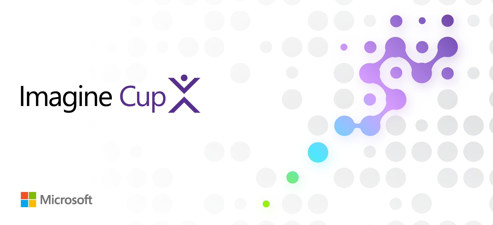

### Resources to help you enter, and perhaps win, the Imagine Cup 🏆

# Welcome to Your Imagine Cup Journey

> Microsoft believes that the next great breakthrough can come from anyone, anywhere. Now entering its 23rd year, with nearly 2 million competitors from around the world, the Imagine Cup stands as the premier global technology startup competition for visionary student entrepreneurs who are harnessing the power of AI to shape the future.

---

## 💡Why Imagine Cup?

By participating in the Imagine Cup, you will:

- 🤖 Build and scale with AI technologies through access to Microsoft's cutting-edge platforms and services.
- 💼 Receive expert technical and entrepreneurial mentorship to guide your journey.
- 🏆 Compete for a chance to win USD100,000 and an exclusive mentorship session with Microsoft CEO, Satya Nadella.

It’s your moment to turn your visionary ideas into impactful startups and take your innovation to the global stage!

---
🚀 Start your journey now by submitting your innovative AI-powered startup idea. Qualify for Founders Hub and unlock access to:

- USD1,000 in Azure credits
- USD2,500 in OpenAI credits
- Self-paced training and tools to help bring your idea to life!
- Learn more at the Imagine Cup Website.

## 🤝 Mentorship & Community

No great project is built in isolation. That’s why we encourage you to seek out mentors and leverage the [Imagine Cup Discord community](https://discord.gg/3bNDZ3hC). Whether it's advice on tech stack choices, refining your pitch, or navigating challenges, mentorship can make a huge difference.
